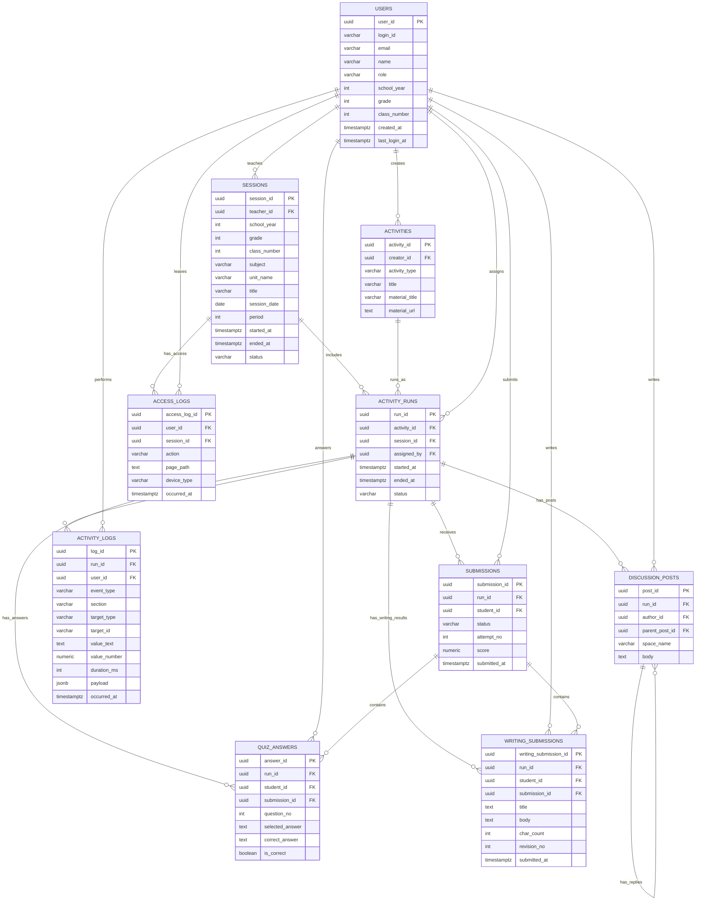

# LMS Database Schema Spec

## 1. 목적

이 문서는 NL2SQL PoC에서 사용하는 LMS 데이터베이스 구조를 설명한다. 목표는 개발자가 테이블 관계를 빠르게 이해하고, 자연어 질문을 SQL로 바꿀 때 어떤 테이블을 조인해야 하는지 판단할 수 있게 하는 것이다.

PoC에서는 정규화를 과하게 하지 않는다. 팀원이 바로 이해할 수 있도록 `classes`, `courses`, `course_sessions`를 나누지 않고, 실제 수업 단위를 `sessions` 하나로 표현한다.

## 2. 한 줄 구조

```text
학생/교사
  -> 수업
  -> 활동 실행
  -> 제출/로그/퀴즈/토론/글쓰기결과
```

## 3. 핵심 테이블

| 테이블 | 쉬운 설명 | 대표 질문 |
| --- | --- | --- |
| `users` | 학생, 교사, 관리자 | "3학년 2반 학생은?" |
| `sessions` | 실제 수업 차시. 과목/학년/반 정보 포함 | "5월 과학 수업은?" |
| `activities` | 퀴즈, 읽기, 글쓰기, 토론 같은 활동 원형 | "퀴즈 활동은?" |
| `activity_runs` | 특정 수업에서 실행된 활동 | "그 수업에서 어떤 활동이 실행됐나?" |
| `submissions` | 학생별 제출 상태/점수 | "퀴즈 안 낸 학생은?" |
| `activity_logs` | 활동 중 행동 로그 | "읽기 오래 한 학생은?" |
| `access_logs` | 로그인/입장/페이지 이동 | "수업에 접속한 학생은?" |
| `quiz_answers` | 퀴즈 문항별 답안 | "정답률은?" |
| `discussion_posts` | 토론 글과 댓글 | "토론 댓글 많이 쓴 학생은?" |
| `writing_submissions` | 글쓰기 활동의 최종 제출 글 | "글쓰기 분량이 긴 학생은?" |

## 4. ER Diagram



## 5. 주요 흐름

### 5.1 사용자와 학년/반

```text
users
```

의미:

- 학생의 소속 정보는 `users.school_year`, `users.grade`, `users.class_number`에 직접 저장한다.
- 별도의 `classes` 테이블을 두지 않는다.
- 교사와 관리자는 학년/반 값이 NULL일 수 있다.

대표 SQL:

```sql
SELECT
  name,
  school_year,
  grade,
  class_number
FROM users
WHERE role = 'student'
  AND school_year = 2026
  AND grade = 3
  AND class_number = 2;
```

### 5.2 수업과 활동 흐름

```text
sessions
  -> activity_runs
  -> activities
```

의미:

- `sessions`는 실제 수업 차시다.
- 기존의 "과목"과 "수업 차시" 정보를 `sessions`에 함께 둔다.
- 예: `subject = '과학'`, `title = '물의 순환 읽기'`, `session_date = '2026-05-06'`.
- `activities`는 활동 원형이고, `activity_runs`는 특정 수업에서 실행된 활동이다.

대표 SQL:

```sql
SELECT
  s.subject,
  s.title AS session_title,
  a.title AS activity_title,
  a.activity_type,
  ar.started_at
FROM activity_runs ar
JOIN activities a ON a.activity_id = ar.activity_id
JOIN sessions s ON s.session_id = ar.session_id
WHERE s.grade = 3
  AND s.class_number = 2;
```

### 5.3 학생 제출 흐름

```text
users
  -> submissions
  -> activity_runs
  -> activities
```

의미:

- 학생별 활동 제출 상태와 점수는 `submissions`에 있다.
- 제출이 어떤 활동에 대한 것인지 보려면 `activity_runs`, `activities`를 조인한다.

대표 질문:

```text
3학년 2반에서 퀴즈를 제출하지 않은 학생은?
```

대표 SQL:

```sql
SELECT
  u.name,
  a.title AS activity_title,
  s.status
FROM submissions s
JOIN users u ON u.user_id = s.student_id
JOIN activity_runs ar ON ar.run_id = s.run_id
JOIN activities a ON a.activity_id = ar.activity_id
WHERE u.role = 'student'
  AND u.grade = 3
  AND u.class_number = 2
  AND a.activity_type = 'quiz'
  AND s.status <> 'submitted';
```

### 5.4 활동 로그 흐름

```text
users
  -> activity_logs
  -> activity_runs
  -> activities
```

의미:

- 활동 중 발생한 행동은 `activity_logs`에 저장된다.
- 읽기 시간, 타이핑 횟수, 활동 시작 여부 같은 행동 분석에 사용한다.

대표 이벤트:

| event_type | 의미 |
| --- | --- |
| `activity_started` | 활동 시작 |
| `activity_completed` | 활동 완료 |
| `page_viewed` | 읽기 페이지 조회 |
| `question_answered` | 퀴즈 문항 응답 |
| `text_typed` | 글쓰기 입력 |
| `ai_message_sent` | 학생이 AI 도움 요청 로그를 남김 |
| `discussion_posted` | 토론 글 작성 |

대표 SQL:

```sql
SELECT
  u.name,
  SUM(al.duration_ms) / 1000.0 AS reading_seconds
FROM activity_logs al
JOIN users u ON u.user_id = al.user_id
JOIN activity_runs ar ON ar.run_id = al.run_id
JOIN activities a ON a.activity_id = ar.activity_id
WHERE a.activity_type = 'reading'
  AND al.event_type = 'page_viewed'
GROUP BY u.user_id, u.name
ORDER BY reading_seconds DESC
LIMIT 10;
```

### 5.5 접속 로그 흐름

```text
users
  -> access_logs
  -> sessions
```

의미:

- 로그인, 수업 입장, 수업 퇴장, 페이지 이동은 `access_logs`에 저장된다.
- "접속했지만 제출하지 않은 학생" 같은 질문에서 `submissions`와 함께 사용한다.

대표 action:

| action | 의미 |
| --- | --- |
| `login` | 로그인 |
| `logout` | 로그아웃 |
| `join_session` | 수업 입장 |
| `leave_session` | 수업 퇴장 |
| `navigate` | 페이지 이동 |
| `open_material` | 자료 열람 |

### 5.6 퀴즈 답안 흐름

```text
quiz_answers
  -> users
  -> activity_runs
  -> activities
```

의미:

- 퀴즈 문항별 학생 답안은 `quiz_answers`에 있다.
- 문항 테이블과 선택지 테이블을 따로 두지 않고, PoC에서는 답안 테이블에 문항 내용과 정답 여부를 함께 저장한다.

대표 SQL:

```sql
SELECT
  u.name,
  COUNT(*) FILTER (WHERE qa.is_correct)::numeric / NULLIF(COUNT(*), 0) AS accuracy
FROM quiz_answers qa
JOIN users u ON u.user_id = qa.student_id
GROUP BY u.user_id, u.name
ORDER BY accuracy DESC
LIMIT 10;
```

### 5.7 토론 흐름

```text
discussion_posts
  -> users
  -> activity_runs
```

의미:

- 토론 글과 댓글은 모두 `discussion_posts`에 저장한다.
- `parent_post_id IS NULL`이면 원글, `parent_post_id IS NOT NULL`이면 댓글이다.

대표 SQL:

```sql
SELECT
  u.name,
  COUNT(*) AS post_count
FROM discussion_posts dp
JOIN users u ON u.user_id = dp.author_id
GROUP BY u.user_id, u.name
ORDER BY post_count DESC
LIMIT 10;
```

### 5.8 글쓰기 제출 결과 흐름

```text
writing_submissions
  -> users
  -> activity_runs
```

의미:

- 글쓰기 또는 AI 글쓰기 활동에서 학생이 최종 제출한 글은 `writing_submissions`에 저장한다.
- `submissions`는 제출 상태와 점수 같은 요약 정보를 담고, `writing_submissions`는 실제 글 본문과 글자 수 같은 세부 결과를 담는다.
- 같은 학생이 다시 제출하는 경우 `revision_no`로 버전을 구분할 수 있다.

대표 SQL:

```sql
SELECT
  u.name,
  w.char_count,
  w.submitted_at
FROM writing_submissions w
JOIN users u ON u.user_id = w.student_id
JOIN activity_runs ar ON ar.run_id = w.run_id
JOIN activities a ON a.activity_id = ar.activity_id
WHERE a.activity_type IN ('writing', 'ai_writing')
ORDER BY w.char_count DESC
LIMIT 10;
```

## 6. 테이블별 핵심 컬럼

### users

| 컬럼 | 설명 |
| --- | --- |
| `user_id` | 사용자 PK |
| `name` | 이름 |
| `role` | `student`, `teacher`, `admin` |
| `school_year` | 학생 소속 학년도 |
| `grade` | 학생 학년 |
| `class_number` | 학생 반 |

### sessions

| 컬럼 | 설명 |
| --- | --- |
| `session_id` | 수업 PK |
| `teacher_id` | 담당 교사 |
| `school_year` | 수업 대상 학년도 |
| `grade` | 수업 대상 학년 |
| `class_number` | 수업 대상 반 |
| `subject` | 과목명 |
| `unit_name` | 단원명 |
| `session_date` | 수업 날짜 |
| `period` | 교시 |
| `status` | 수업 상태 |

### activities

| 컬럼 | 설명 |
| --- | --- |
| `activity_id` | 활동 PK |
| `activity_type` | `reading`, `quiz`, `writing`, `discussion`, `ai_writing`, `external_page` |
| `title` | 활동 제목 |
| `material_title` | 자료 제목 |
| `material_url` | 자료 URL |

### activity_runs

| 컬럼 | 설명 |
| --- | --- |
| `run_id` | 실행된 활동 PK |
| `activity_id` | 활동 원형 |
| `session_id` | 수업 |
| `started_at` | 실행 시작 |
| `ended_at` | 실행 종료 |

### submissions

| 컬럼 | 설명 |
| --- | --- |
| `submission_id` | 제출 PK |
| `run_id` | 실행된 활동 |
| `student_id` | 학생 |
| `status` | `assigned`, `in_progress`, `submitted`, `returned`, `retry` |
| `score` | 점수 |
| `submitted_at` | 제출 시각 |

### activity_logs

| 컬럼 | 설명 |
| --- | --- |
| `log_id` | 활동 로그 PK |
| `run_id` | 실행된 활동 |
| `user_id` | 행동한 사용자 |
| `event_type` | 행동 유형. 예: `page_viewed`, `question_answered`, `text_typed` |
| `section` | 활동 내 영역. 예: `reading`, `quiz`, `writing` |
| `target_type` | 행동 대상 유형. 예: `page`, `question`, `block` |
| `target_id` | 행동 대상 ID. 예: 페이지 번호, 문항 ID, 글쓰기 블록 ID |
| `value_text` | 문자형 로그 값 |
| `value_number` | 숫자형 로그 값 |
| `duration_ms` | 행동 지속 시간, 밀리초 |
| `payload` | 추가 세부 정보 JSON |
| `occurred_at` | 행동 발생 시각 |

### writing_submissions

| 컬럼 | 설명 |
| --- | --- |
| `writing_submission_id` | 글쓰기 제출 결과 PK |
| `run_id` | 실행된 글쓰기 활동 |
| `student_id` | 학생 |
| `submission_id` | 공통 제출 요약 |
| `title` | 글 제목 |
| `body` | 최종 제출 글 본문 |
| `char_count` | 글자 수 |
| `revision_no` | 제출 버전 |
| `submitted_at` | 글 제출 시각 |

## 7. NL2SQL에서 자주 쓰는 조인 패턴

### 학생별 제출 상태

```sql
FROM submissions s
JOIN users u ON u.user_id = s.student_id
JOIN activity_runs ar ON ar.run_id = s.run_id
JOIN activities a ON a.activity_id = ar.activity_id
```

### 수업별 활동 목록

```sql
FROM activity_runs ar
JOIN activities a ON a.activity_id = ar.activity_id
JOIN sessions s ON s.session_id = ar.session_id
```

### 학생별 활동 로그

```sql
FROM activity_logs al
JOIN users u ON u.user_id = al.user_id
JOIN activity_runs ar ON ar.run_id = al.run_id
JOIN activities a ON a.activity_id = ar.activity_id
```

### 학생별 글쓰기 제출 결과

```sql
FROM writing_submissions w
JOIN users u ON u.user_id = w.student_id
JOIN activity_runs ar ON ar.run_id = w.run_id
JOIN activities a ON a.activity_id = ar.activity_id
```

## 8. 설계 단순화 포인트

PoC에서는 다음 테이블을 일부러 분리하지 않았다.

| 분리하지 않은 것 | 현재 처리 방식 |
| --- | --- |
| 학급 테이블 | `users.school_year`, `users.grade`, `users.class_number`로 학생 소속을 직접 표현 |
| 과목 테이블 | `sessions.subject`, `sessions.unit_name`으로 수업에 직접 포함 |
| 수업 차시 테이블 분리 | `sessions` 하나가 과목 정보와 차시 정보를 함께 가짐 |
| 학습 자료 테이블 | `activities.material_title`, `activities.material_url`로 처리 |
| 퀴즈 문항/선택지 테이블 | `quiz_answers`에 문항 내용과 정답 여부를 저장 |
| 토론 댓글 테이블 | `discussion_posts.parent_post_id`로 원글/댓글 구분 |

이렇게 단순화한 이유는 PoC에서 테이블 수를 줄이고, NL2SQL이 조인 경로를 더 쉽게 찾도록 하기 위해서다.

나중에 실제 서비스 수준으로 확장한다면 `classes`, `courses`, `course_sessions`, `class_members`를 다시 분리할 수 있다.
