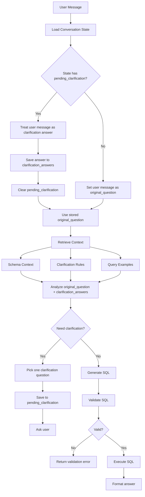

# NL2SQL Agent Implementation Spec

## 1. 목적

이 문서는 LMS 데이터베이스를 대상으로 하는 NL2SQL 에이전트의 구현 흐름을 정의한다. 개발 팀원은 이 명세를 기준으로 자연어 질문 분석, 명료화 질문, SQL 생성, SQL 검증, DB 실행, 결과 포맷팅 모듈을 구현한다.

## 2. 전체 플로우

PoC의 핵심은 `original_question`을 고정하고, 명료화 답변을 `clarification_answers`에 누적한 뒤, 더 이상 확인할 ambiguity가 없을 때 SQL로 전환하는 것이다.

```text
User Message
  -> Load Conversation State
  -> Route Message
      - New Question
      - Clarification Answer
  -> Context Preparation
      - Schema Retrieval
      - Clarification Rule Retrieval
      - Example Query Retrieval
  -> Question Analysis
  -> Clarification Decision
    -> Clarification Question
    -> SQL Generation
  -> SQL Validation
  -> SQL Execution
  -> Answer Formatting
```

### Flow Diagram



### Loop Summary

```text
1. 사용자 메시지를 받는다.
2. conversation state를 먼저 읽는다.
3. state에 pending_clarification이 있으면 이번 메시지를 명료화 답변으로 처리한다.
4. 명료화 답변은 clarification_answers에 저장하고, original_question은 그대로 둔다.
5. state에 pending_clarification이 없으면 이번 메시지를 새 original_question으로 저장한다.
6. original_question + clarification_answers 기준으로 context를 가져오고 질문을 다시 분석한다.
7. 더 확인할 ambiguity가 있으면 하나만 pending_clarification에 저장하고 사용자에게 묻는다.
8. 없으면 SQL 생성으로 넘어간다.
```

## 3. 핵심 원칙

- 에이전트는 기본적으로 `SELECT` 쿼리만 생성한다.
- 질문이 모호하면 SQL을 생성하지 않고 명료화 질문을 먼저 반환한다.
- 명료화 질문은 한 번에 하나만 한다.
- `pending_clarification`에는 현재 기다리는 명료화 질문 하나만 저장한다.
- 원 질문은 `original_question`에 고정하고, 명료화 답변은 `clarification_answers`에 누적한다.
- 스키마, 명료화 규칙, 예시 SQL은 하드코딩하지 않고 별도 데이터 파일로 관리한다.
- SQL 실행 전 반드시 validator를 통과해야 한다.
- SQL 결과와 함께 실제 실행 SQL을 사용자에게 보여준다.

## 4. 권장 파일 구조

```text
src/edu2sql
  agent.py
  retriever.py
  sql_validator.py
  db.py

data/
  schema_dictionary.json
  clarification_rules.json
  query_examples.json
```

## 5. 데이터 파일 역할

### schema_dictionary.json

스키마와 도메인 용어를 설명한다.

역할:

- 테이블 설명
- 주요 컬럼 설명
- 테이블 간 조인 경로
- 지표와 컬럼 매핑
- 한국어 용어와 DB 표현 매핑

예:

```json
{
  "tables": {
    "users": {
      "description": "학생, 교사, 관리자 정보",
      "columns": {
        "user_id": "사용자 ID",
        "name": "사용자 이름",
        "role": "student, teacher, admin",
        "grade": "학년",
        "class_number": "반"
      }
    },
    "submissions": {
      "description": "학생별 활동 제출 상태와 점수",
      "columns": {
        "run_id": "실행된 활동 ID",
        "student_id": "학생 ID",
        "status": "assigned, in_progress, submitted, returned, retry",
        "score": "점수"
      }
    }
  },
  "metric_mappings": {
    "제출률": "submitted submissions / total submissions",
    "평균 점수": "AVG(submissions.score)",
    "글쓰기 분량": "SUM(writing_submissions.char_count)",
    "읽기 시간": "SUM(activity_logs.duration_ms) WHERE event_type = 'page_viewed'"
  }
}
```

### clarification_rules.json

모호한 질문을 감지하고 되물을 질문을 제공한다.

예:

```json
[
  {
    "id": "ambiguous_recent",
    "trigger_keywords": ["최근", "요즘", "요새"],
    "missing_slot": "date_range",
    "question": "\"최근\"은 어떤 기간을 의미하나요?",
    "options": ["최근 7일", "이번 달", "가장 최근 수업"],
    "default_if_skipped": "최근 7일",
    "priority": 10
  }
]
```

### query_examples.json

few-shot SQL 예시를 제공한다. 명료화가 없었던 질문은 `clarification_answers`를 빈 객체로 둔다. 명료화가 있었던 질문은 `original_question`, `clarification_answers`, `resolved_question`, `sql`을 함께 저장한다.

예:

```json
[
  {
    "id": "quiz_non_submitters_by_class",
    "original_question": "3학년 2반에서 퀴즈를 제출하지 않은 학생은?",
    "clarification_answers": {},
    "resolved_question": "3학년 2반 학생 중 퀴즈 활동을 제출하지 않은 학생 목록",
    "sql": "SELECT u.name, a.title, s.status FROM submissions s JOIN users u ON u.user_id = s.student_id JOIN activity_runs ar ON ar.run_id = s.run_id JOIN activities a ON a.activity_id = ar.activity_id WHERE u.role = 'student' AND u.grade = 3 AND u.class_number = 2 AND a.activity_type = 'quiz' AND s.status <> 'submitted';",
    "tags": ["submission", "quiz", "student"]
  },
  {
    "id": "writing_length_rank_after_clarification",
    "original_question": "요즘 글쓰기 분량 많은 학생 보여줘",
    "clarification_answers": {
      "date_range": "this_month",
      "writing_length_metric": "char_count"
    },
    "resolved_question": "이번 달에 글쓰기 제출 글자 수 합계가 많은 학생 순위",
    "sql": "SELECT u.name, SUM(w.char_count) AS total_char_count FROM writing_submissions w JOIN users u ON u.user_id = w.student_id WHERE w.submitted_at >= date_trunc('month', CURRENT_DATE) GROUP BY u.user_id, u.name ORDER BY total_char_count DESC LIMIT 10;",
    "tags": ["writing", "rank", "clarification", "date_range", "char_count"]
  }
]
```

## 6. Runtime State

state에는 "현재 명료화 질문을 기다리는 중인가"와 "사용자가 이미 답한 명료화 값"만 저장한다.

질문 분석 결과, 슬롯 목록, 기본값, 가정은 state에 저장하지 않는다. 매 턴 `original_question + clarification_answers`를 기반으로 다시 계산한다. 이렇게 해야 state 관리가 단순하고, 중간 분석 결과가 꼬일 위험이 줄어든다.

```json
{
  "mode": "awaiting_clarification",
  "original_question": "요즘 글쓰기 분량 많은 학생 보여줘",
  "clarification_answers": {},
  "pending_clarification": {
    "rule_id": "ambiguous_recent",
    "slot": "date_range",
    "question": "\"요즘\"은 어떤 기간을 의미하나요?",
    "options": ["최근 7일", "이번 달", "가장 최근 수업"]
  }
}
```

명료화 답변을 받으면 `clarification_answers`에 값을 저장하고 `pending_clarification`을 비운다. 그 뒤 원래 질문을 다시 처리한다.

```json
{
  "mode": "ready",
  "original_question": "요즘 글쓰기 분량 많은 학생 보여줘",
  "clarification_answers": {
    "date_range": "this_month"
  },
  "pending_clarification": null
}
```

예를 들어 `"글쓰기 분량이 가장 많은 학생 5명 보여줘"`는 `grade`, `class_number`, `date_range`가 비어 있어도 명료화하지 않는다. 전체 학생, 전체 기간 기준으로 조회하고 그 가정을 답변에 명시한다.

## 7. Retrieval Strategy

### 7.1 Schema Retrieval

MVP에서는 전체 스키마를 항상 넣어도 된다. 단, 프롬프트가 길어지면 질문 키워드 기준으로 관련 테이블만 선택한다.

추천 규칙:

| 사용자 표현 | 관련 테이블 |
| --- | --- |
| 학생, 학년, 반 | users |
| 과목, 수업 | sessions |
| 활동, 퀴즈, 읽기, 글쓰기 | activities, activity_runs |
| 제출, 점수, 제출률 | submissions |
| 클릭, 체류 시간, 읽기 시간 | activity_logs |
| 로그인, 접속, 입장 | access_logs |
| 글쓰기 제출 글, 최종 글, 글자 수 | writing_submissions |
| 토론, 댓글 | discussion_posts |
| 퀴즈 답안, 정답률 | quiz_answers |

### 7.2 Clarification Rule Retrieval

키워드 매칭과 priority를 사용한다.

```python
def retrieve_clarification_rules(question: str, rules: list[dict]) -> list[dict]:
    candidates = []

    for rule in rules:
        score = 0
        for keyword in rule.get("trigger_keywords", []):
            if keyword in question:
                score += 10

        score += rule.get("priority", 0)

        if score > rule.get("priority", 0):
            candidates.append((score, rule))

    candidates.sort(key=lambda item: item[0], reverse=True)
    return [rule for _, rule in candidates]
```

처음에는 embedding retrieval이 필요 없다. 질문 표현이 다양해져 키워드 매칭이 부족해질 때 embedding을 도입한다.

### 7.3 Example Query Retrieval

MVP에서는 태그와 키워드 기반으로 2-3개 예시를 가져온다.

```python
def retrieve_query_examples(question: str, examples: list[dict], limit: int = 3) -> list[dict]:
    scored = []
    for example in examples:
        score = 0
        example_text = " ".join([
            example.get("original_question", ""),
            example.get("resolved_question", ""),
            " ".join(example.get("tags", [])),
        ])
        for tag in example.get("tags", []):
            if tag in question:
                score += 5
        for token in ["퀴즈", "제출", "AI", "토론", "읽기", "점수", "접속"]:
            if token in question and token in example_text:
                score += 3
        if score > 0:
            scored.append((score, example))

    scored.sort(key=lambda item: item[0], reverse=True)
    return [example for _, example in scored[:limit]]
```

## 8. Clarification Decision

SQL 생성 전 아래 조건을 확인한다.

명료화가 필요한 경우:

- 기간 표현이 모호함: "최근", "요즘", "이번"
- 지표 기준이 모호함: "참여율", "잘한", "많이 쓴"
- 대상 범위가 모호함: "우리 반", "학생들", "그 활동"
- 비교 기준이 불분명함: "높은지", "관련 있는지"

명료화가 필요하지 않은 경우:

- 학년/반이 빠졌지만 질문이 전체 학생 기준으로 해석 가능함
- 기간이 빠졌지만 전체 기간 기준으로 해석 가능함
- 과목이 빠졌지만 전체 과목 기준으로 해석 가능함
- 출력 개수가 빠졌지만 기본 `LIMIT 50` 또는 순위 기본 `LIMIT 10`을 적용할 수 있음

명료화 질문 선택 우선순위:

1. 결과를 크게 바꾸는 지표 기준
2. 기간
3. 대상 학급/과목/활동
4. 정렬 기준 또는 출력 개수

판단 규칙:

```python
def decide_clarification(analysis: dict, rules: list[dict]) -> dict | None:
    for rule in rules:
        slot = rule["missing_slot"]
        if slot in analysis["ambiguous_slots"]:
            return {
                "rule_id": rule["id"],
                "slot": slot,
                "question": rule["question"],
                "options": rule.get("options", []),
            }
    return None
```

출력 형식:

```json
{
  "type": "clarification",
  "question": "글쓰기 분량을 어떤 기준으로 계산할까요?",
  "options": ["글자 수 합계", "평균 글자 수", "제출 글 수"],
  "slot": "writing_length_metric"
}
```

## 9. SQL Generation Contract

SQL generator는 아래 입력을 받는다.

```json
{
  "original_question": "요즘 글쓰기 분량 많은 학생 보여줘",
  "clarification_answers": {
    "date_range": "this_month",
    "writing_length_metric": "char_count_sum"
  },
  "schema_context": {},
  "examples": []
}
```

SQL generator는 아래 형식으로 반환한다.

```json
{
  "type": "sql",
  "sql": "SELECT ...",
  "assumptions": ["전체 기간 기준으로 조회했습니다."]
}
```

## 10. SQL Validation

SQL 실행 전 validator는 아래를 검사한다.

필수 조건:

- `SELECT` 또는 `WITH`로 시작해야 한다.
- 한 번에 하나의 statement만 허용한다.
- 금지 키워드를 포함하면 실패한다.
- 존재하지 않는 테이블명을 사용하면 실패한다.
- `LIMIT`이 없는 단순 목록 조회에는 `LIMIT 50`을 추가한다.

금지 키워드:

```text
INSERT, UPDATE, DELETE, DROP, ALTER, TRUNCATE, CREATE, GRANT, REVOKE, COPY, CALL
```

허용 테이블:

```text
users
sessions
activities
activity_runs
submissions
activity_logs
access_logs
quiz_answers
discussion_posts
writing_submissions
```

검증 결과:

```json
{
  "valid": true,
  "sql": "SELECT ... LIMIT 50",
  "errors": []
}
```

## 11. Query Execution

DB 실행 모듈은 read-only 커넥션 사용을 권장한다.

실행 결과 형식:

```json
{
  "columns": ["name", "score"],
  "rows": [
    {"name": "김민준", "score": 92}
  ],
  "row_count": 1,
  "sql": "SELECT ..."
}
```

## 12. Answer Formatting

응답은 아래 순서로 구성한다.

1. 한 줄 요약
2. 결과 표
3. 사용한 SQL
4. 가정 또는 제한 사항

예:

```text
3학년 2반에서 퀴즈를 제출하지 않은 학생은 총 3명입니다.

| 학생 | 활동 | 상태 |
| --- | --- | --- |
| 최수아 | 상태 변화 퀴즈 | assigned |

사용한 SQL:
SELECT ...

가정:
전체 기간 기준으로 조회했습니다.
```

## 13. Agent Pseudocode

```python
def answer_question(question: str, state: dict | None = None) -> dict:
    if state and state.get("pending_clarification"):
        state = handle_clarification_answer(question, state)
        question = state["original_question"]
    else:
        state = {
            "mode": "ready",
            "original_question": question,
            "clarification_answers": {},
            "pending_clarification": None,
        }

    schema_context = retrieve_schema_context(question)
    clarification_rules = retrieve_clarification_rules(question, load_rules())
    examples = retrieve_query_examples(question, load_examples())

    analysis = analyze_question(
        question=question,
        state=state,
        schema_context=schema_context,
        clarification_rules=clarification_rules,
    )

    clarification = decide_clarification(
        analysis=analysis,
        rules=clarification_rules,
    )

    if clarification is not None:
        state["mode"] = "awaiting_clarification"
        state["pending_clarification"] = clarification
        return {
            "type": "clarification",
            "question": clarification["question"],
            "options": clarification.get("options", []),
            "state": state,
        }

    sql_result = generate_sql(
        question=question,
        clarification_answers=state["clarification_answers"],
        state=state,
        schema_context=schema_context,
        examples=examples,
    )

    validation = validate_sql(sql_result["sql"])
    if not validation["valid"]:
        return {
            "type": "error",
            "message": "SQL 검증에 실패했습니다.",
            "errors": validation["errors"],
        }

    rows = execute_sql(validation["sql"])
    answer = format_answer(
        question=question,
        sql=validation["sql"],
        rows=rows,
        assumptions=sql_result.get("assumptions", []),
    )

    return {
        "type": "answer",
        "answer": answer,
        "sql": validation["sql"],
        "rows": rows,
        "state": state,
    }
```

## 14. 명료화 답변 처리

사용자가 명료화 질문에 답하면 아래처럼 처리한다.

```python
def handle_clarification_answer(answer: str, state: dict) -> dict:
    pending = state.get("pending_clarification")
    if not pending:
        return state

    slot = pending["slot"]
    state["clarification_answers"][slot] = normalize_answer(answer, slot)
    state["pending_clarification"] = None
    state["mode"] = "ready"

    return state
```

예:

```text
User: 요즘 글쓰기 분량 많은 학생 보여줘
Agent: "요즘"은 어떤 기간을 의미하나요?
User: 이번 달
Agent State: clarification_answers.date_range = "this_month"
Agent: 원래 질문을 다시 분석한 뒤 SQL 생성 또는 다음 명료화 진행
```

## 15. 테스트 질문 세트

개발 후 아래 질문으로 동작을 확인한다.

명료화 없이 SQL 생성:

- 3학년 2반 학생들의 평균 퀴즈 점수를 보여줘
- 2026년 5월 과학 수업의 제출률을 알려줘
- 글쓰기 분량이 가장 많은 학생 5명을 보여줘
- 읽기 활동에서 평균 체류 시간이 긴 학생 순위 보여줘

명료화 필요:

- 요즘 글쓰기 분량 많은 학생 보여줘
- 우리 반에서 퀴즈 안 낸 학생 알려줘
- 참여율 높은 수업이 뭐야?
- 잘한 학생 순위 보여줘
- 그 활동 제출 안 한 학생 누구야?

## 16. 구현 우선순위

1. `schema_dictionary.json`, `clarification_rules.json`, `query_examples.json` 작성
2. JSON loader 구현
3. keyword 기반 retriever 구현
4. clarification decider 구현
5. SQL generator prompt 작성
6. SQL validator 구현
7. DB executor 연결
8. formatter 구현
9. 테스트 질문 세트로 검증

## 17. MVP 범위

MVP에서는 다음을 하지 않는다.

- 파인튜닝
- 벡터 DB
- 복잡한 multi-agent orchestration
- 데이터 수정 쿼리
- 장기 대화 메모리

MVP에서는 다음만 구현한다.

- JSON 기반 schema/context retrieval
- 키워드 기반 clarification retrieval
- few-shot SQL generation
- read-only SQL validation/execution
- 간단한 표 형태 결과 응답
